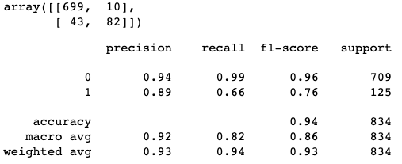
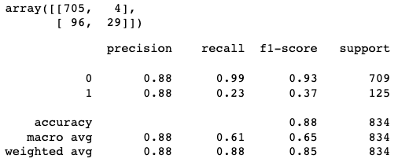
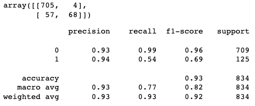
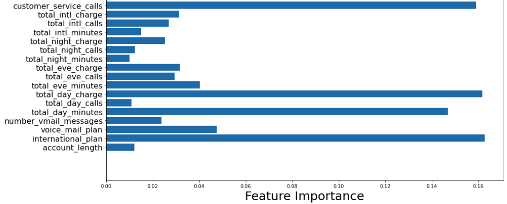
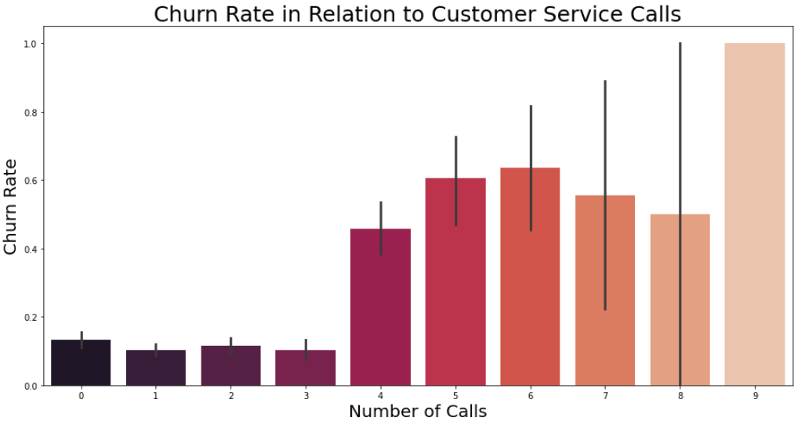
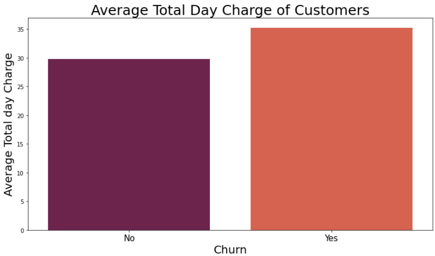
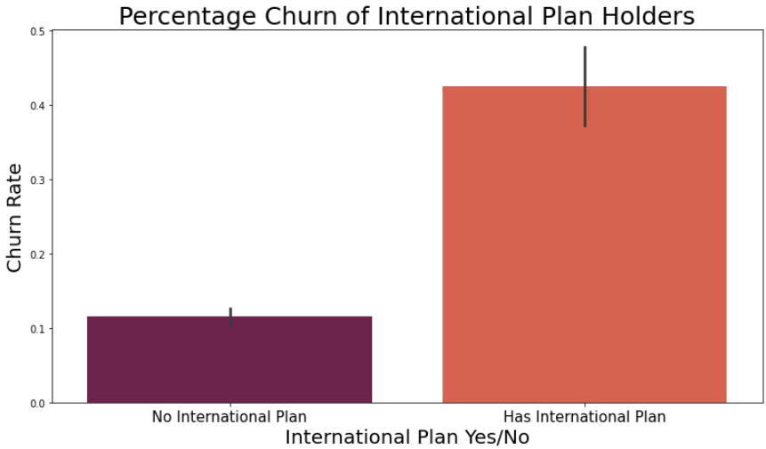

# SyriaTel Customer Churn Classification Project 
---

<b>Author:</b> Michael Holthouser

---
## Business Understanding
---
SyriaTel has tasked me to provide prediction analysis on whether their customers will churn soon. To churn in its broadest sense according to Wikipedia is, "A measure of the number individuals or items moving out of a collective group over a specific period." 
</img>

- **Stakeholder**: SyriaTel Executives

- **Business Problem**: SyriaTel is determined to find out when their customers will churn. 

- **Business Questions**: What aspects of the company's operations can they improve upon in order to retain their current customers?

## Data Understanding
---
The title of this dataset is called "Churn in Telecom's dataset" from <a href="https://www.kaggle.com/datasets/becksddf/churn-in-telecoms-dataset">kaggle.com</a>

- Number of records: 3333
- Number of columns: 20
- Target variable: <b>churn</b>

The dataset provided information on the following features for each customers: 
- <code><b>state</b></code>, string. 2-letter code of the US state of customer residence
- <code><b>account_length</b></code>, numerical. Number of months the customer has been with the current telco provider
- <code><b>area_code</b></code>, string="area_code_AAA" where AAA = 3 digit area code.
- <code><b>international_plan</b></code>, (yes/no). The customer has international plan.
- <code><b>voice_mail_plan</b></code>, (yes/no). The customer has voice mail plan.
- <code><b>number_vmail_messages</b></code>, numerical. Number of voice-mail messages.
- <code><b>total_day_minutes</b></code>, numerical. Total minutes of day calls.
- <code><b>total_day_calls</b></code>, numerical. Total minutes of day calls.
- <code><b>total_day_charge</b></code>, numerical. Total charge of day calls.
- <code><b>total_eve_minutes</b></code>, numerical. Total minutes of evening calls.
- <code><b>total_eve_calls</b></code>, numerical. Total number of evening calls.
- <code><b>total_eve_charge</b></code>, numerical. Total charge of evening calls.
- <code><b>total_night_minutes</b></code>, numerical. Total minutes of night calls.
- <code><b>total_night_calls</b></code>, numerical. Total number of night calls.
- <code><b>total_night_charge</b></code>, numerical. Total charge of night calls.
- <code><b>total_intl_minutes</b></code>, numerical. Total minutes of international calls.
- <code><b>total_intl_calls</b></code>, numerical. Total number of international calls.
- <code><b>total_intl_charge</b></code>, numerical. Total charge of international calls
- <code><b>number_customer_service_calls</b></code>, numerical. Number of calls to customer service
- <code><b>churn</b></code>, (yes/no). Customer churn - target variable.

## Data Cleaning
---
To create an accurate classification model, the following steps were taken to prepare the data: 

- Checking for missing data or generic placeholders within the dataset. 
- Ensuring the column names were in the conventional python format by adding "underscores" between words. 
- Converting columns of the object data types, to a numerical data type.
- Dropping columns that were not pertinent to this project or to the business question('phone_number', 'area_code').
- Create dummy variables for the 'state' column. 

## Modeling
---

For this preject I chose to use three different classification models: 

- Baseline model: <code>Logistic regression</code>
- Model 2: <code>Decision tree</code>
- Model 3: <code>Random forest</code>

I have elected to use <b>Recall</b> as my evaluation metric for this particular project. The recall score is true positive divided by the true positive plus the false negative. It is the measure of actual observations which are predicted correctly. I chose this metric because we want to capture as many positives as possible, and is the best metric to use when we have imbalanced data. 
For this model, false negatives will cost the company more than false positives because misidentifying someone as "churned" and using customer retention strategies would be less expensive and would cost the SyriaTel more than letting a churned customer fall through the cracks. 

## Baseline Model: Logistic Regression
---
### Results:

**Logistic Regression Model Results:**
- Recall Score (Training): <code>22%</code>
- Recall Score (Test): <code>15%</code>

## Model 2: Decision Tree 
---
### Results:

**Decision Tree Model Results:**

- Recall Score (Training): <code>72%</code>
- Recall Score (Test): <code>66%</code>

## Model 3: Random Forest
---
### Results:

**Random Forest Model Results:**

- Recall Score (Training): <code>30%</code>
- Recall Score (Test): <code>23%</code>

## Model 3: Random Forest with GridSearch
---
### Results:

**Random Forest with GridSearchCV Results:**

- Recall Score (Training): <code>71%</code>
- Recall Score (Test): <code>54%</code>

### Evaluation: 
Of the three models, the decision tree classifier had the highest metrics and had the highest accuracy. But with a recall score of only 66% on the test data, with further investigation I believe the score could be increased even more. 

## Feature Importance
---
Next, I took a look at feature importance, to get a better idea what features contributed to the churn rate the most. 

### Recommendations

#### Recommendation 1: 
Looking at the first feature from the importance graph, I used a bar graph to depict how many customer service calls it took for a customer to make in order to increase their likelihood of churning. When a customer makes at least 4 calls to customer service, the churn number significantly increases. 

I recommend that managers come up with new training techniques to help customer service representatives assist these customers that are unhappy with their service.

#### Recommendation 2: 
The next big contributor to customer churn was total day charge. From the bar graph below, the customers who have churned have an average total day charge of about 35.18. Those customers who are still customers of SyriaTel have an average total day charge of 29.78.

I recommend executives brainstorm ways to retain customers that have an average total day charge of 35 dollars. Possibly creating more incentives and added perks to their phone plans could sway these customers from terminating their contracts.

#### Recommendation 3: 
The last big contributor to customer churn that I will mention is international plan. It appears roughly 42% of customers with an international plan end up churning.

I recommend further investigation into reasons why customers with international plans are more likely to churn. 

## Conclusion
---
SyriaTel should reach out to their customers with an average total day charge of 35 dollars, customers that have made at least 4 calls to customer service, and those with international plans to check if they are happy with their service. With that data, implement new tactics to retain those customers who have a high likelihood of churning. 

## Repository Structure
---
├── data
├── images
├──.gitignore
├── Final_Notebook.ipynb
├── Presentation.pdf
├── Presentation.pptx
├── README.md
